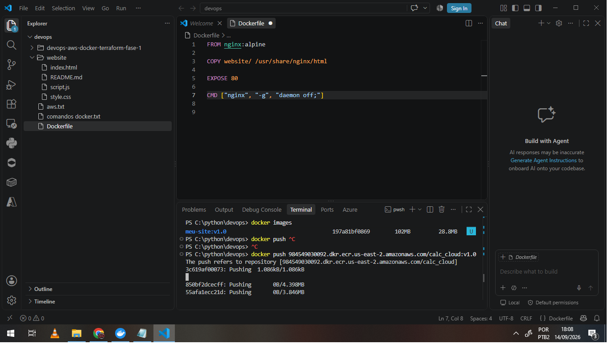
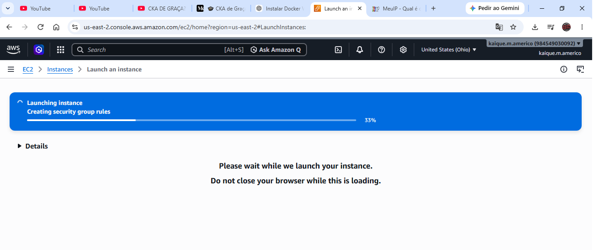
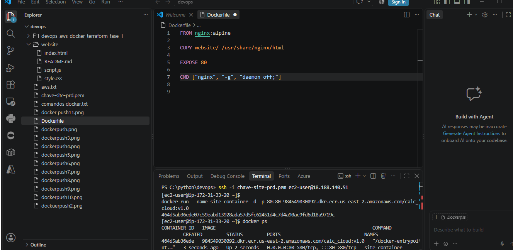
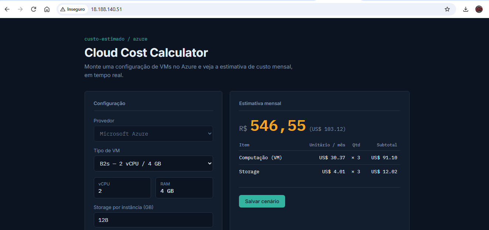

# Configurando AWS ECR - EC2

Documentação técnica do processo de provisionamento e deploy do projeto
na AWS usando Docker, Amazon ECR e Amazon EC2.

## Objetivo

Registrar o seguinte processo:
1. Criação do repositório de imagens no Amazon ECR
2. Build e push da imagem Docker
3. Criação da instância EC2
4. Deploy do container na EC2
5. Validação e limpeza dos recursos

## Pré-requisitos

- Conta AWS, para esse projeto você consegue com o Free TIER
- AWS CLI instalado (local) (`aws configure`)
- Docker instalado localmente
- Par de chaves SSH (.pem) criado na AWS
- Permissões IAM para EC2 e ECR


## Passo 1 — Criar repositório no Amazon ECR

**Console AWS:**
1. Acesse https://console.aws.amazon.com/ecr
2. Clique em **Create repository**
3. Nome: `meu-site:v1`
4. Clique em **Create repository**

**Via AWS CLI:**
```bash
aws ecr create-repository \
  --repository-name meu-site \
  --region us-east-2
```

**Resultado:** URI no formato
`<account-id>.dkr.ecr.us-east-2.amazonaws.com/calc_cloud:v1.0'

## Passo 2 — Autenticar Docker no ECR

```bash
aws ecr get-login-password --region us-east-2 | docker login --username AWS --password-stdin <id>.dkr.ecr.us-east-2.amazonaws.com
```

Saída esperada: `Login Succeeded`


## Passo 3 — Build e push da imagem

```bash
# Build local
docker build -t meu-site:v1.0 .

# Tag para o ECR
docker tag meu-site:v1.0 <account-id>.dkr.ecr.us-east-2.amazonaws.com/calc_cloud:v1.0

# Push
docker push <account-id>.dkr.ecr.us-east-2.amazonaws.com/calc_cloud:v1.0
```

## Passo 4 — Criar instância EC2

**Configurações usadas Via Painel AWS:**
- AMI: Amazon Linux 2
- Tipo: `t2.micro` (free tier)
- Key pair: `minha-chave.pem`
- Storage: 8 GB gp2


## Passo 5 — Conectar via SSH

LINUX: 
```bash
chmod 400 minha-chave.pem
ssh -i chave-site-prd.pem ec2-user@<ip-publico>
```
WINDOWS:

```bash icacls ".\chave-site-prd.pem" /inheritance:r |
icacls "chave-site-prd.pem" /grant:r "$($env:USERDOMAIN)\$($env:USERNAME):R"
```

## Passo 6 — Instalar Docker na EC2

```bash
sudo yum update -y
sudo yum install docker -y
sudo systemctl start docker
sudo systemctl enable docker
sudo usermod -aG docker ec2-user
```

> Faça logout e login para que o linux faça a releitura do grupo de acesso.


## Passo 7 — Deploy do container na EC2

```bash
# Autenticar ECR
aws ecr get-login-password --region us-east-2 | \
  sudo docker login --username AWS --password-stdin \
  <account-id>.dkr.ecr.us-east-2.amazonaws.com/calc_cloud:v1.0

# Pull da imagem
sudo docker pull \
  <account-id>.dkr.ecr.us-east-2.amazonaws.com/calc_cloud:v1.0

# Rodar container
sudo docker run -d -p 80:80 --name meu-site:v1 \
  <account-id>.dkr.ecr.us-east-2.amazonaws.com/calc_cloud:v1.0
```

---

## Validação

- Acessar `http://<ip-publico>` no navegador
- `sudo docker ps` — container rodando
- `sudo docker logs meu-site:v1` — logs da aplicação

### Evidências






---

## Limpeza (evitar cobrança)

```bash
# Parar instância
aws ec2 stop-instances --instance-ids i-xxxxxxxx

# (Opcional) Terminar
aws ec2 terminate-instances --instance-ids i-xxxxxxxx

# Deletar imagem do ECR
aws ecr batch-delete-image \
  --repository-name meu-site:v1\
  --image-ids imageTag=latest
```

## ⚠️ Segurança

- Nunca subir o arquivo `.pem` para o Git
- Usar IAM Roles em vez de access keys quando possível
- Restringir o Security Group ao próprio IP
- Parar/terminar instâncias após testes
- Nunca colocar credenciais neste documento